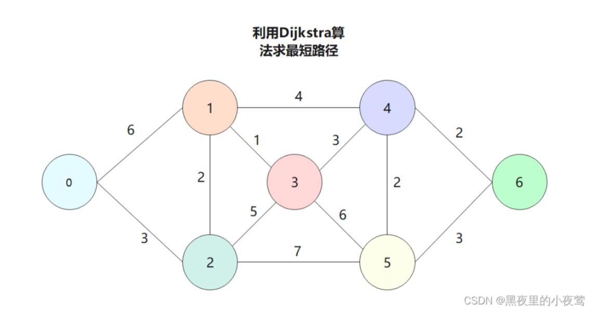
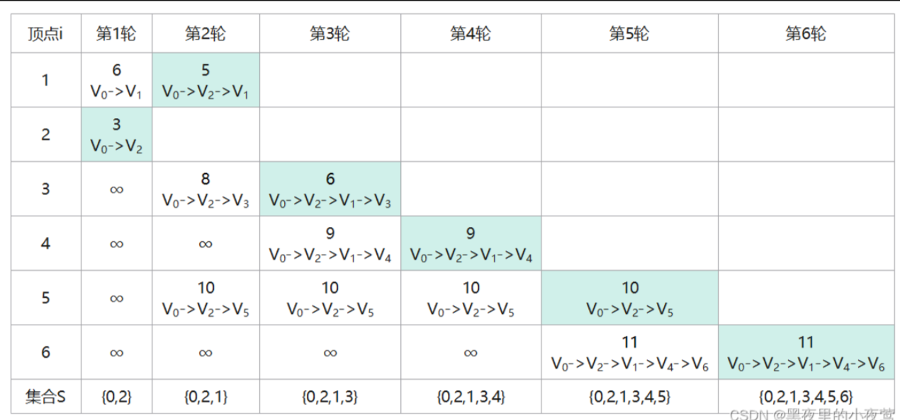

# 最短路径问题

## 1.Dijkstra算法

初始化，将，0到0的距离设置为0，接下来进行n轮循环：

* 选出最小的dist[i]，然后将visited[i]=true;
* 用最小的dist[i]去更新与i相连的节点，如果dist[i]+grid[i] [j]<dist[j]，dist[j]=dist[i]+grid[i] [j],并记录到对应存放更新后dist的队列或者数组中。
* 重复上述步骤

n轮之后可以得到0-(1~n)的min_dist.

例如：

