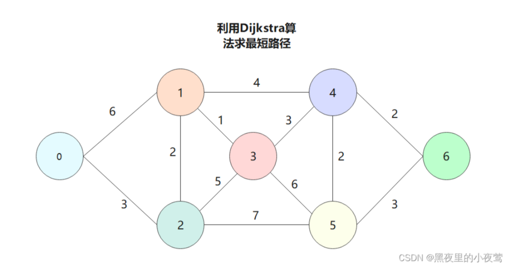
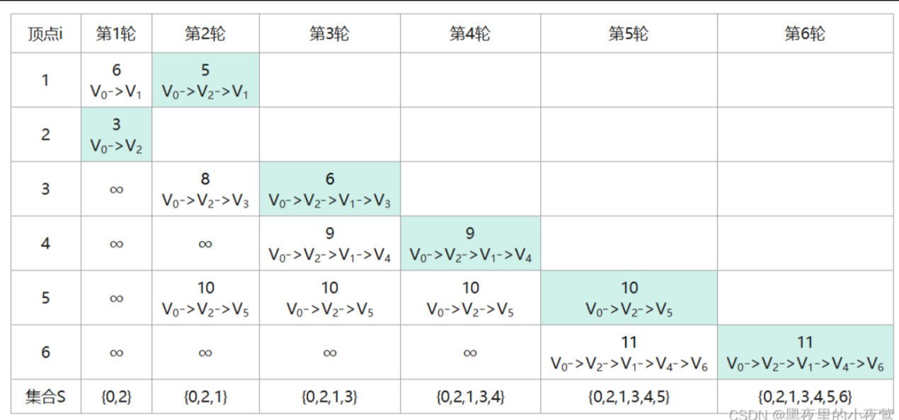
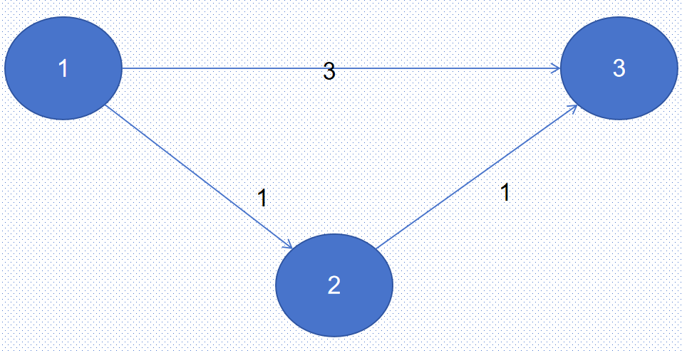

# 最短路径问题

## 1.Dijkstra算法

初始化，将，0到0的距离设置为0，接下来进行n轮循环：

* 选出最小的dist[i]，然后将visited[i]=true;
* 用最小的dist[i]去更新与i相连的节点，如果dist[i]+grid[i] [j]<dist[j]，dist[j]=dist[i]+grid[i] [j],并记录到对应存放更新后dist的队列或者数组中。
* 重复上述步骤

n轮之后可以得到0-(1~n)的min_dist.

例如：






### 不适合负权边存在的情况!!


## 2.Bellman-Ford 算法

### 2.1.算法流程：

* 初始化：将dist[1]设为0
* 遍历每一条边，当出现dist[end]>dist[start]+weight[start->end]时，dist[end]=dist[begin]+weight[start->end]
* 重复n-1轮可得到结果（不存在负权自环，或者负权环的情况），或者当所有节点的dist都没有更新时，退出循环，当循环次数大于n时，表示存在负权自环或者负权环，无法求出最短距离，退出。

### 2.2.模板

```C++
//Bellman-Ford算法
edge[m];//m条边
dist[n];//n个点距离初始点最短距离

//初始化
memset(dist, 0x3f, sizeof dist);
dist[1]=0;//设求的是距离1最近的点。

for(int i=0;i<n-1;i++){//n-1轮循环
    for(int j=0;j<m;j++){//遍历每一条边
        int s=edge[i].start,e=edge[i].end,w=edge[i].weight;
        dist[e]=min(dist[e],dist[s]+w);
    }
}

//如果有限制，通过edge数不超过K条，可以改为for(int i=0;i<k-1;i++)

//防止串联现象，例如在限制边数不超过k的条件下，需要使用备份防止串联现象。
//串联现象：
```



串联现象：更新1->2的距离后紧接着又更新2->3的距离，导致一轮循环更新了1->3的两条边的距离，从而不满足限制k=1的要求。

解决办法：

```c++
//添加备份，用上一次的dist去更新dist而不是使用更新中的dist，有点像一次往外扩充一轮。
for(int i=0;i<n-1;i++){//n-1轮循环
	//备份
	memcpy(last,dist,sizeof dist);
    for(int j=0;j<m;j++){//遍历每一条边
        int s=edge[i].start,e=edge[i].end,w=edge[i].weight;
        dist[e]=min(dist[e],last[s]+w);
    }
}
```


### 2.3.总结

* 复杂度为O(n*m)
* 可以用来处理带负权边的图，也可以用来判断存在负权自环或者负权环(但是不建议)。
* 一般情况下，Bellman-Ford算法劣于SPFA算法，但是当出现限制K条边数的情况下，只能使用Bellman-Ford算法。

## 3.SPFA算法

### 3.1算法流程

* 初始化，dist[1]设为0，将1加入队列q中(q用来存储更新了距离的节点编号)
* 当队列q不为空，继续使用q中的节点去更新与其相连节点的dist,并将更新后的节点加入队列q(如果不存在)
* 继续循环知道，队列q为空
* 如果陷入死循环，说明存在负环，可以计算每个dist更新的次数来判断，如果次数大于n次，可以认定存在负环。

### 3.2模板

```c++
//求1-n最短路径。
//初始化
dist[1]=0;
queue q;
q.push(1);
in_queue[1]=true;//标记是否在队列中

//循序更新dist
while(!q.empty()){
    int =s.q.front();
    q.pop();
    in_queue[s]=false;
    
    //用dist[s]更新其出度节点
    for(auto ne: ne_list){
        int e = ne.first; int w=ne.second;//e代表终点，w代表权重
        if(dist[e]>dist[s]+w){
            dist[e]=dist[s]+w;
            if(!in_queue[e]){
                in_queue[e]=true;
                q.push(e);
            }
        }
    }
}


//判断是否存在负环
//初始化
//将所有节点都作为起始点，因为图未必是连通图
for(int i=1;i<=n;i++){
    q.push(i);
    dist[i]=0;
    in_queue[i]=true;
	cnt[i]=0;//记录更新dist[i]的次数
}

while(!q.empty()){
    int s=q.front();
    in_queue[s]=false;
    
    for(auto ne: ne_list){
        int e = ne.first; int w=ne.second;//e代表终点，w代表权重
        if(dist[e]>dist[s]+w){
            dist[e]=dist[s]+w;
            cnt[e]++;
            if(cnt[e]>n)cout<<"存在负环";
            if(!in_queue[e]){
                in_queue[e]=true;
                q.push(e);
            }
        }
    }
}
```

### 3.3分析

* SPFA可以用于存在负权的图，也可以用来判断是否存在负环。
* 时间复杂度，一般为O(m),最坏情况O(nm),n代表节点数，m代表边数。

## 4.Floyd算法

### 4.1算法流程

* 初始化：grid[i] [j]数组存边，并且存放i->j的距离，grid[i] [i]=0,没有直接相连的节点grid[i] [j]距离设为较大的数值(相当于无穷大)
* 三重循环:最外重表示用经过前k个点来更新i->j的距离，所以dist[i] [j]=min(dist[i] [j]，dist[i] [k]+dist[k] [j]);
* 最终得到任意两个节点的最短路。

### 4.2模板

```c++
//初始化
vector<vector<int>> grid(n+1,vector<int>(n+1,INT_MAX/2));
    for(int i=1;i<=n;i++){
        {
           grid[i][i]=0;
           
        }
    }
for(int i=0;i<m;i++){
        int a,b,c;
        cin>>a>>b>>c;
        grid[a][b]=min(grid[a][b],c);
    }

//算法主体
for(int k=1;k<=n;k++)
        for(int i=1;i<=n;i++)
            for(int j=1;j<=n;j++){
                    if(grid[i][j]>grid[i][k]+grid[k][j]){
                        grid[i][j]=grid[i][k]+grid[k][j];
                    }
                }

```

### 4.3分析

* 初始距离不能设为INT_MAX，因为更新过程可能使其略小于INT_MAX，所以判断可以使用设定的较大值/2
* 时间复杂度为O(n^3)
* 可以得到任意两点距离最小值
* 不可存在负环

