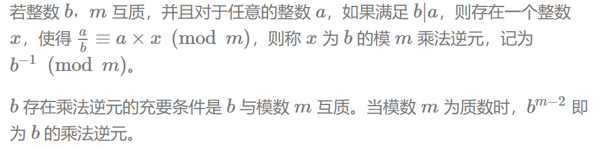

# 快速幂

## 1.快速幂问题

* 问题：求$a^b$ 
* 问题扩展：求$a^b$ %c

### 1.1思路

* 暴力求解：b个a相乘
* 快速幂：
  * $a^b$ 可以将b转变为二进制，例如$a^{10}$ 转变为$a^{1010}$ 
  * 所以$a^{10}=a^{2^3+2^1}$ 
  * 因此在累乘过程中，乘数为$a^ {2^k}$

### 1.2 代码模版

````c++
int a,b;
int res=1; 
while(b){
    if(b&1)res=res*a;//如果b对应二进制位为1
    a=a*a;//乘数$a^ {2^k}$ 变为 $a^ {2^k+1}$
    b>>=1;//b右移一位
}

//问题扩展
int a,b,c;
int res=1%c; 
while(b){
    if(b&1)res=res*a%c;//如果b对应二进制位为1
    a=a*a%c;//乘数$a^ {2^k}$ 变为 $a^ {2^k+1}$
    b>>=1;//b右移一位
}
````

### 1.3 分析

* 暴力求解：时间复杂度O(n)
* 快速幂：时间复杂度O($log_2n$)

## 2.快速幂求逆元

### 2.1 问题描述

* 给定n 组 $a_i$,$p_i$ , $a_i$模$p_i$ 的乘法逆元，若逆元不存在则输出 `impossible`。

* 乘法逆元定义：



### 2.2思路

* 求两者最大公约数，为1则互质。
* 互质的话就可以求逆元$b^{m-2}mod(m)$

### 2.3代码实现

```c++
#include<iostream>
using namespace std;

int gcd(int a,int b){
    return b==0?a:gcd(b,a%b);
}

long long fun(int a,int b){
    int tmep=b+2;
    long long res =1;
    res=res%tmep;
    while(b){
        if(b&1)res=res*a%tmep;
        a=a*(long long)a%tmep;
        b>>=1;
    }
    return res;
}

int main(){
    int n;cin>>n;
    for(int i=0;i<n;i++){
        int a,b;cin>>a>>b;
        if(gcd(a,b)==1){
            cout<<fun(a,b-2)<<endl;
        }
        else cout<<"impossible"<<endl;
    }
    return 0;
}
```


