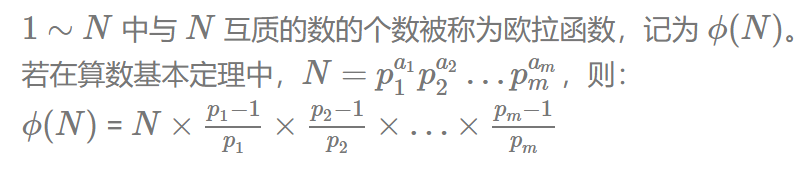
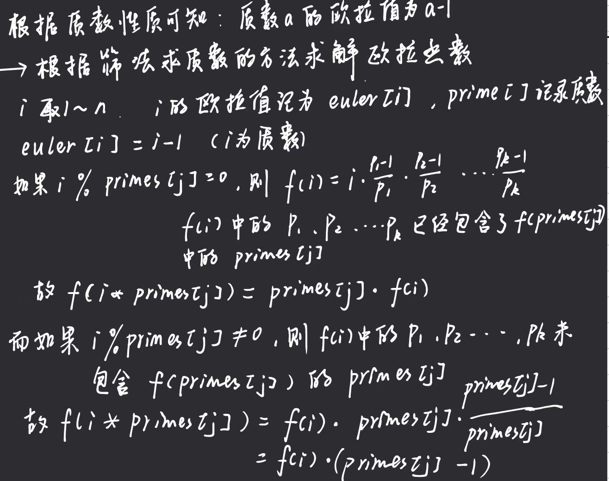

# 欧拉函数

## 1.欧拉函数

### 1.1问题导入

* 任意给定正整数n，请问在小于等于n的正整数之中，有多少个与n构成互质关系？

* 这个结果可以由欧拉函数来求解。

### 1.2 欧拉函数是什么及其证明



* 欧拉函数具体证明见：[【数学】欧拉函数的计算公式及其证明 - Tshaxz - 博客园](https://www.cnblogs.com/Tshaxz/p/15176782.html)
  * 里面详细介绍了欧拉函数及其证明

### 1.3 代码模版

```c++
//可以根据求约数数量的模版实现

int n;//最原始的数据n，计算1~n有多少与n构成互质关系
int res = n;//存放结果
//计算P1、P2......
for(int i=2;i<=n/i;i++){
	if(n%i==0){
        res=res*(i-1)/i;
        while(n&i==0){
            n/=i;
        }
    }
}
if(n>1)res=res*(n-1)/n;//最后一项约数

cout<<res<<endl;
```

### 1.4 算法分析

* 时间复杂度为O(sqrt(n)log(n))

## 2.欧拉函数---求1~n的欧拉函数和

### 2.1问题描述

* 任意给定正整数n，请问在小于等于n的正整数之中，欧拉函数之和为多少？

### 2.2 求解原理



### 2.3代码模板

```c++
//辅助数组
st[N];//记录有没有标记为非质数
eulers[N];//记录欧拉值
primes[N];//记录质数
int cnt;//记录加入到primes的质数数量


//主体函数
long long get_eulers(int n){
    eulers[1]=1;//1的欧拉值为1
    for(int i=2;i<=n;i++){
        if(!st[i]){
            primes[cnt++]=i;
            eulers[i]=i-1;
        }
        for(int j=0;primes[j]<=n/i;j++){
            st[primes[j]*i]=true;
            if(i%primes[j]==0){
                eulers[i*primes[j]]=eulers[i]*primes[j];
               	break;
            }
            eulers[i*primes[j]]=eulers[i]*(primes[j]-1);
        }
    }
    long long res=0;
    for(int i=1;i<=n;i++){
        res+=eulers[i];
    }
    return res;
}
```

### 2.4分析

该算法成功将时间复杂度降到了O(n)