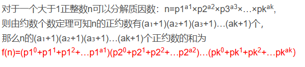
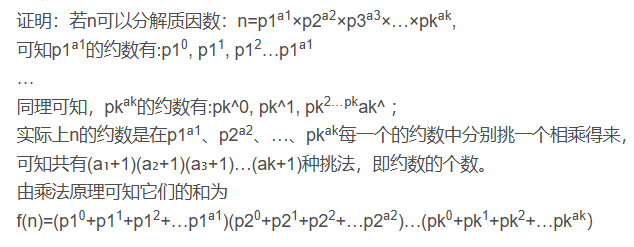

# 简单数学问题--约数

## 1.试除法求约数

### 1.1问题描述

给定一个正整数n，求其所有约数

### 1.2解法思路

* 暴力求解：从1~n开始遍历，如果n%i==0，则这个数为约数。

```c++
for(int i=1;i<=n;i++){
	if(n%i==0)res.push_back(i);
}
```

* 试除法：在n%i==0的同时，n/i也是n的一个约数，所以只需要遍历到sqrt(n)，就可以得到所有结果

```c++
for(int i=1;i<=n/i;i++){//用i<=n/i效率较sqrt(n)高
	if(n%i==0){
	res.push_back(i);
	res.push_back(n/i);
	}
}
```

### 1.3算法分析

* 暴力解：时间复杂度O(n)

* 试除法：时间复杂度O(sqrt(n))

## 2.求约数个数

### 2.1问题描述

求一个正整数n的约数个数。

### 2.2解题思路--约数个数定理

#### 2.2.1解法原理

* **约数个数定理**


* 定理证明：


#### 2.2.2代码模版

```C++
//求质因数
unordered_map<int,int> primes;//存质因数次数
for(int i=2;i<=n/2;i++){
    while(n%i==0){
		primes[i]++;
        n/=i;
    }
}
if(n>1) primes[n]++;
int res=1;//int范围的数的质因数大约为1500个，如果范围更广可以使用long long
for(auto it:primes)res=res*(it.second+1);
cout<<res;
```

### 2.3算法分析

* 时间复杂度：O(sqrt(n))

## 3.求约数之和

### 3.1问题描述

给定一个数n，求其所有约数之和

### 3.2解法思路--基于约数个数定理

#### 3.2.1算法原理

* 原理



* 证明



#### 3.2.2算法模板

```c++
unordered_map<int,int> primes;//存质因数次数
for(int i=2;i<=n/2;i++){
    while(n%i==0){
		primes[i]++;
        n/=i;
    }
}
if(n>1) primes[n]++;
long long res=1;
for(auto it: primes){
    int a=it.first,b=it.second;//底数和次数
    int temp=1;
    while(b--)t=t*a+1;//等比求和
    res = res*temp;
}
cout<<res;
```

## 4.最大公约数

### 4.1算法描述

给定a,b,求两者最大公约数

### 4.2 算法思路 -- 欧几里得法

#### 4.2.1算法原理

* d | a，d | b，d | (a+b)，d | (ax + by)即能整除a，d能整除b，那么d就能整除a+b，也能整除a的若干倍+b的若干倍
* 同时 a mod b = a - a/b(下取整)*b 
* 根据上条 gcd(a,b)=gcd(b,a%b)  ，gcd(a,b)返回最大公约数。
  * 注：0和a的公约数为a


#### 4.2.2算法模板

```c++
int gcd(int a,int b){
    return b?gcd(b,a%b):a;
}
```


