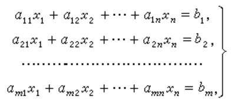
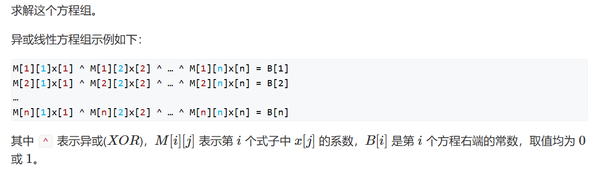

# 高斯消元

## 1.高斯消元求解多元线性方程

### 1.1问题描述



求解

### 1.2 高斯消元思路

* 线性代数讲过······
* 首先转化为N*N+1的矩阵来看待
* 选出i~N中第j列数字绝对值最大的行，将其所在行挪到第i行
* 然后将第i行首位数字系数（a[i] [j]）化为1，并用该行与其他行进行计算，即将其他行减去当行第j列元素倍的第i行。
* 依次进行，如果遇到第j列首位数字都是0，则行i不变，进行下一列的计算
* 最终得到的结果是一个上三角。如果最终i<n，则考虑多解或者无解问题：如果多解，则a[i] [n]~a[n-1] [n]定为0；否则无解。
* 解可以从下到上计算出

### 1.3 代码模版

```c++
//矩阵
int N;
double a[N][N+1];
double eps=1e-6; 
//高斯
int gauss(){
	int r,c;//行列
    for(c=0,r=0;c<n;c++){
        //选出当列最大绝对值
        int t=r;
        for(int i=r;i<n;i++){
            if(fabs(a[i][c])>fabs(a[t][c]))
                t=i;
        }
        if(fabs(a[t][c])<eps)continue; //当列元素均为0
        
        for(int i=c;i<=n;i++)swap(a[t][i],a[r][i]);//交换两行
        for(int i=n;i>=c;i--)a[r][i]/=a[r][c];//第r行元素第c列元素化为1
        for(int i=r+1;i<n;i++)//用该行去消去下方第c列元素
            if(fabs(a[i][c])>eps){
                for(int j=n;j>=c;j--)
                    a[i][j]-=a[i][c]*a[r][j];
            }
        r++;//进入下一行
    }
    if(r<n){//如果最后上三角不完全
		for(int i=r;i<n;i++)
            if(fabs(a[i][n])>eps)
                return 2;//无解
        return 1;//否则无限解
    }
    for(int i=n-1;i>=0;i--)
        for(int j=i+1;j<=n;j++){
            a[i][n] -= a[i][j]*a[j][n];
        }
		
    return 0;//唯一解
}
```

## 2.高斯消元求解异或线性方程组

### 2.1问题描述



### 2.2 求解思路

* c代表当前列，r代表当前行，与上问相同，均是消成上三角
* 找到第c列中以1开头的行，如果不是r行，更换两行，如果此列均为0，则进入下一列。
* 不同之处，以当前行去消后面的行时，采用异或运算，因为异或操作不会影响矩阵的秩。
* 最终得到的r小于n，说明上三角不完美，可以判断是否有多解或者无解，如果a[i] [n]==1(r<=i<=n) 则无解，反之多组解。
* r==n，一组解，可以通过从下向上逐行算出结果。

### 2.3 代码模版

```c++
int a[N][N];
int n;

int gauss(){
    int c,r;
    for(c=0,r=0;c<n;c++){
        int t=r;
        for(int i=r;i<n;i++)
            if(a[i][c]==1)//找到第一个以1开头的就行
            {
                t=i;
                break;
            }
        if(a[t][c]==0)continue;
        if(t!=r){//当前行首元素为1就不需要换
            for(int i=c;i<=n;i++)swap(a[r][i],a[t][i]);
        }
        for(int i=r+1;i<n;i++)
            if(a[i][c])
                for (int j = n; j >= c; j -- )
                    a[i][j]=a[i][j]^a[r][j];//变为异或操作了
        r++;
    }
    if(r<n){
        for(int i=r;i<n;i++)
            if(a[i][n])return 2;
        return 1;
    }
    
    for(int i=n-1;i>=0;i--)
        for(int j=i+1;j<=n;j++){
            a[i][n]^=a[i][j]*a[j][n];  
        }
    return 0;
}

```

